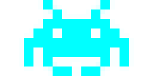

# Game Space Invaders Java

## Overview
The Game Space Invaders is a Java-based application that recreates the classic arcade game where players control a spaceship to shoot down waves of alien invaders.

## Features
- **Player Control**: Control a spaceship to move left, right, and shoot.
- **Alien Waves**: Multiple waves of alien invaders with increasing difficulty.
- **Graphics**: Includes images for the spaceship and aliens to enhance the gaming experience.
- **Scoring**: Track and display the player's score.

## Installation
1. Clone the repository:
    ```bash
    git clone https://github.com/Hritickjha/Game-space-invaders-java-.git
    ```
2. Navigate to the project directory:
    ```bash
    cd Game-space-invaders-java-
    ```
3. Compile the Java files:
    ```bash
    javac App.java SpaceInvaders.java
    ```

## Usage
1. Run the main application:
    ```bash
    java App
    ```
2. Use the arrow keys to move the spaceship and the spacebar to shoot at the aliens.

## Code Description
The `App.java` file initializes and runs the game, while `SpaceInvaders.java` handles the game logic and rendering, including player control, alien movements, and collision detection.

## Screenshots



## Contributing
1. Fork the repository.
2. Create a new branch (`git checkout -b feature-branch`).
3. Make your changes and commit them (`git commit -m 'Add some feature'`).
4. Push to the branch (`git push origin feature-branch`).
5. Open a pull request.

## Contact
For any questions or suggestions, please contact [Hritickjha](https://github.com/Hritickjha).
